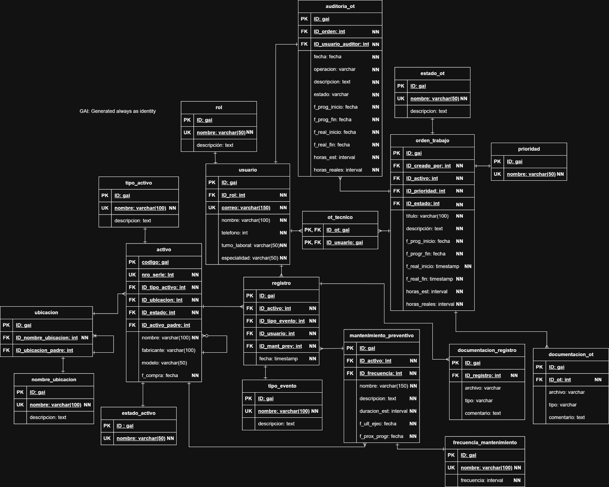

# 🛠️ Sistema Computarizado de Gestión de Mantenimiento (CMMS) - BoscoMaq S.A.

**Instancia Supervisada de Formación Práctica Profesional (ISFPP) - Bases de Datos 2025 - UNPSJB**

Este repositorio contiene el diseño e implementación de una base de datos relacional para un **CMMS (Computerized Maintenance Management System)** destinado a la empresa de producción industrial BoscoMaq S.A.

El objetivo principal de este sistema es centralizar la información de los activos físicos, organizar y planificar las tareas de mantenimiento (preventivo y correctivo), asignar trabajos a técnicos, llevar registros de auditoría y conservar la trazabilidad de toda la información.

## 📋 Características y Requerimientos

El modelo de base de datos abarca los siguientes módulos principales:

* 👥 **Gestión de Usuarios y Técnicos:** Almacena información de administradores, planificadores y técnicos, incluyendo roles, turnos laborales y especialidades.
* 📍 **Ubicaciones:** Estructura jerárquica para representar la disposición física de la empresa (ej. Planta -> Sector -> Línea de Producción).
* ⚙️ **Gestión de Activos:** Registro detallado de máquinas y equipos (estado, especificaciones) con soporte para jerarquías (activos compuestos por otros activos).
* 📋 **Órdenes de Trabajo (OT):** Seguimiento de mantenimientos preventivos y correctivos, incluyendo prioridades, estados, tiempos estimados vs. reales y técnicos asignados.
*  **Mantenimiento Preventivo:** Programación de tareas rutinarias en base a frecuencias definidas.
*  **Registros y Documentación:** Historial de eventos de mantenimiento, soporte para archivos adjuntos (manuales, reportes) y comentarios.
*  **Auditoría:** Trazabilidad estricta sobre cambios de datos críticos, como el estado de las órdenes de trabajo.

##  Tecnologías Utilizadas

* **Motor de Base de Datos:** PostgreSQL
* **Lenguaje:** SQL (DDL, DML, TCL)
* **Programación en Base de Datos:** Funciones, Procedimientos Almacenados y Triggers.

##  Entregas y Cronograma del Proyecto

El desarrollo se dividió en 4 etapas principales:

1.  **Fase 1 :** Diagramas conceptuales/relacionales y scripts DDL.
2.  **Fase 2 :** Inserción de datos (DML), procedimientos almacenados y funciones.
3.  **Fase 3 :** Creación de Triggers, Vistas estadísticas y Consultas SQL representativas.
4.  **Fase 4 :** Informe final, diagrama de clases, presentación de diseño y evaluación oral.

##  Modelo Relacional Final

A continuación se presenta el diagrama de la base de datos implementada, detallando las entidades, sus atributos, tipos de datos y las relaciones entre ellas.

